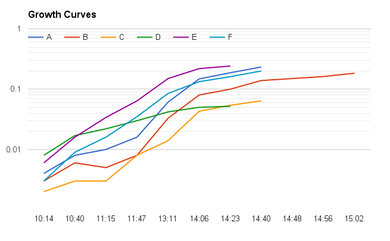

#Cell-Cell attack and Gene Transfer
##Effects of CSP and cell density

###May 12 2016

###Cell cultures

**Attacker: CP2204** Rif-r Nov-s Sp-s. Stock 4/15/16. OD 0.2 BoxMorrison2016#1-20.

**Victim: Cp2215** Nov-r Sp-r. Stock 4/15/16 OD 0.2 BoxMorrison2016#21-40

Thaw Stock cells @ 0C. Dilute for growth in CDM + 1%CAT 12mL/tube. 

Media batch CAT:4/8/16, CDM:5/9/16

To CAT from stock shelf add phosphate and glucose. For 300 mL CAT add 10 mL 0.5 M K2HPO4 (sterile filtered) and 3 mL 20% glucose (sterile filtered).

Grow to OD = 0.2 and chill to 0C for use.

| cells             | Cp2204 | Cp2204 | Cp2204 | CP2215 | CP2215 | CP2215 |
|-------------------|--------|--------|--------|--------|--------|--------|
| vol               | 50 uL  | 100 ul | 200 uL | 50 uL  | 200 uL | 100 uL |
| tube              | A      | B      | C      | D      | E      | F      |
| 5/9/2016 10:50:00 | 0.003  | 0.003  | 0.001  | 0.003  | 0.006  | 0      |
| 5/9/2016 11:20:00 | 0.002  | 0.006  | 0.006  | 0.001  | 0.017  | 0.009  |
| 5/9/2016 12:07:00 | 0.004  | 0.004  | 0.004  | 0.005  | 0.035  | 0.016  |
| 5/9/2016 12:46:00 | 0.001  | 0.003  | 0.009  | 0.013  | 0.08   | 0.03   |
| 5/9/2016 13:30:00 | 0.006  | 0.015  | 0.021  | 0.042  | 0.191  | 0.075  |
| 5/9/2016 14:00:00 | 0.01   | 0.014  | 0.035  | 0.074  | 0.315  | 0.131  |
| 5/9/2016 14:30:00 | 0.017  | 0.038  | 0.055  | 0.125  | RT     | 0.207  |
| 5/9/2016 15:00:00 | 0.027  | 0.053  | 0.076  | 0.202  | 0.466  | 0.266  |
| 5/9/2016 15:41:00 | 0.048  | 0.091  | 0.134  | 0.27   | 0.504  | 0.325  |
| 5/9/2016 16:30:00 | 0.091  | 0.183  | 0.278  | 0.355  | 0.636  | 0.418  |
| 5/9/2016 17:00:00 |        |        | 0.488  |        |        | 0.472  |
|                   |        |        | 0C     |        |        | 0C     |

###Attack Reaction

Cell Prep: 

At OD 0.2 chill to 0C.

Take 2 x 12 mL tubes of cell suspension and spin down at 8kg for 8 min in chilled incubator.

Pour off supernatant and resuspend in 0.75 mL chilled CDM resulting in OD 3.2

Combine cells suspensions to make 1.5 mL suspension, each strain at OD 1.6, hold at 0C.

Prepare reaction tubes according to following scheme. First add CDM to each tube followed by inducer and finally cells. Mix/votex tubes and gently centrifuge to bottom.

**Inducer Prep:**

| component | Stock     | Inducer   | Dilute by   | working stock | Vol/RX | Total (3.2x(Vol/RX)) |
|-----------|-----------|-----------|-------------|---------------|--------|----------------------|
| CSP       | 250 ug/mL | 0.1 ug/mL | 100         | 2.5 ul/mL     | 24 uL  | 76.8 uL              |
| BSA       | 4%        | 0.04%     | 10          | 0.4%          | 60 uL  | 192 uL               |
| CaCl2     | 1 M       | 5 mM      | 10          | 100 mM        | 30 uL   | 96 uL                |

**Reaction Scheme:**

| Reaction | OD of each strain | Vol. Cell Mix | Vol. Inducer | CDM   |
|----------|-------------------|---------------|--------------|-------|
| 1        | 1                 | 375           | 114          | 111   |
| 2        | 2                 | 375           | -            | 225   |
| 3        | 0.6               | 225           | 114          | 261   |
| 4        | 0.6               | 225           | -            | 375   |
| 5        | 0.3               | 112.5         | 114          | 373.5 |
| 6        | .03               | 112.5         | -            | 487.5 |

Put reaction tubes in heat block at 37C for 30 minutes.