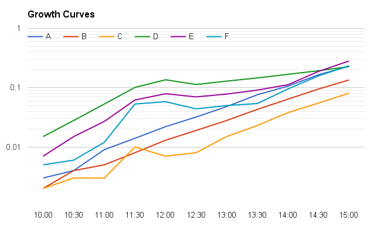

#Cell-Cell attack and Gene Transfer
##Effects of CSP and cell density

###May 19 2016

###Cell cultures

**Attacker: CP2204** Rif-r Nov-s Sp-s. Stock 4/15/16. OD 0.2 BoxMorrison2016#1-20.

**Victim: Cp2215** Nov-r Sp-r. Stock 4/15/16 OD 0.2 BoxMorrison2016#21-40

Thaw Stock cells @ 0C. Dilute for growth in CDM + 1%CAT 12mL/tube.

Media batch CAT:4/6/16, CDM-NCNM:5/18/16 

To CAT from stock shelf add phosphate and glucose. For 300 mL CAT add 10 mL 0.5 M K2HPO4 (sterile filtered) and 3 mL 20% glucose (sterile filtered).

Grow to OD = 0.2 and chill to 0C for use.

| cells | Cp2204 | Cp2204 | Cp2204 | CP2215 | CP2215 | CP2215 |
|-------|--------|--------|--------|--------|--------|--------|
| vol   | 200 uL | 100 ul | 50 uL  | 200 uL | 100 uL | 50 uL  |
| tube  | A      | B      | C      | D      | E      | F      |
| 10:00 | 0.003  | 0.002  | 0.002  | 0.015  | 0.007  | 0.005  |
| 10:30 | 0.004  | 0.004  | 0.003  | 0.028  | 0.015  | 0.006  |
| 11:00 | 0.009  | 0.005  | 0.003  | 0.053  | 0.027  | 0.012  |
|       |        |        |        | RT     | RT     | RT     |
| 11:30 | 0.014  | 0.008  | 0.01   | 0.101  | 0.062  | 0.053  |
| 12:00 | 0.022  | 0.013  | 0.007  | 0.136  | 0.079  | 0.058  |
| 12:30 | 0.032  | 0.019  | 0.008  | 0.113  | 0.07   | 0.044  |
| 13:00 | 0.048  | 0.028  | 0.015  | 0.129  | 0.078  | 0.05   |
|       |        |        |        |        |        | 37C    |
| 13:30 | 0.076  | 0.043  | 0.023  | 0.146  | 0.091  | 0.054  |
|       |        |        |        |        | 37C    |        |
| 14:00 | 0.106  | 0.064  | 0.038  | 0.168  | 0.112  | 0.095  |
| 14:30 | 0.165  | 0.095  | 0.055  | 0.193  | 0.188  | 0.158  |
| 15:00 | 0.23   | 0.135  | 0.081  | 0.227  | 0.282  | 0.235  |
|       | **0C** |        |        | **0C** |        |        |

###Attack Reaction

Cell Prep:

At OD 0.2 chill to 0C.

*note: only 10.4 mL of cells from each 12 mL was used to account for the OD overshoot*

Take 2 x 12 mL tubes of cell suspension and spin down at 8k rcf for 8 min in chilled incubator.

Pour off supernatant and resuspend in 0.75 mL chilled CDM resulting in OD 3.2 *note: initially after centrifuging both tubes had a visible pellet. After pouring off the supernatant the pellet in the D tube disappeared. I'm not sure if it was poured out, or if it was resuspended in the remaining supernatant.*

Combine cells suspensions to make 1.5 mL suspension, each strain at OD 1.6, hold at 0C.

Prepare reaction tubes according to following scheme. First add CDM to each tube followed by inducer and finally cells. Mix/vortex tubes and gently centrifuge to bottom.

**Inducer Prep:**

| component | Stock     | Inducer   | Dilute by   | working stock | Vol/RX | Total (3.2x(Vol/RX)) |
|-----------|-----------|-----------|-------------|---------------|--------|----------------------|
| CSP       | 250 ug/mL | 0.2 ug/mL*| 50          | 5 ug/mL       | 24 uL  | 76.8 uL              |
| BSA       | 4%        | 0.04%     | 10          | 0.4%          | 60 uL  | 192 uL               |
| CaCl2     | 1 M       | 5 mM      | 10          | 100 mM        | 30 uL   | 96 uL                |

**typically 0.1 ug/mL of CSP is used, it was doubled in this case to encourage transformation*

*note: CaCl2 precipitated when diluted in CDM so it was diluted in sterile water instead of CDM*

**Reaction Scheme:**

| Reaction | OD of each strain | Vol. Cell Mix | Vol. Inducer | CDM   |
|----------|-------------------|---------------|--------------|-------|
| 1        | 1                 | 375           | 114          | 111   |
| 2        | 1                 | 375           | -            | 225   |
| 3        | 0.6               | 225           | 114          | 261   |
| 4        | 0.6               | 225           | -            | 375   |
| 5        | 0.3               | 112.5         | 114          | 373.5 |
| 6        | 0.03              | 112.5         | -            | 487.5 |

Put reaction tubes in heat block at 37C for **35 minutes**. *reaction started at: 3:26 PM*

After 30 min reaction the 600 uL reaction mixture was diluted into 6 mL CAT and incubated at 37C for 60 minutes. *Incubation started at: 4:09 PM*

**Expected Results**

|                          | Attacker | Victim    | single cross | single cross | double cross |
|--------------------------|----------|-----------|--------------|--------------|--------------|
| drug                     | Rif-r, Nov-s, Sp-s| N-r, Sp-r | R-r, N-r     | R-r, Sp-r    | RNS          |
| expected number of cells | 10^9     | 10^9      | 10^5         | 10^5         | 30           |
| Dilution for plating     | 10^-5    | 10^-5     | 10^-2        | 10^-2        | 10^-1        |
| number of plates         | 1        | 1         | 2            | 2            | 3            |

**Dilution Scheme**

600 uL of reaction is diluted into 6 mL = 10^-1, 3 Plates: 3RNS

700 uL transferred into 7 mL = 10^-2, 4 plates: 2RN, 2RS

70 uL transferred into 7 mL = 10^-4, don't plate

600 uL transferred into 6 mL = 10^-5, 2 plates: 1R, 1S

Plates are filled with:

1. 3 mL CAT agar
2. 1.5 mL cell mixed with 1.5 mL agar
3. 3 mL CAT agar
4. 3 mL Drug agar

**Drug Assay Prep**

| Drug | overlay  | Stock     |
|------|----------|-----------|
| R    | 40 ug/mL | 20 mg/mL  |
| N    | 10 ug/mL | 10 mg/mL  |
| S    | 160      | 100 mg/mL |

|     | total volume | R uL | S uL | N uL  |
|-----|--------------|------|------|-------|
| R   | 20 mL        | 40   | -    | -     |
| S   | 20 mL        | -    | 33.3 | -     |
| RN  | 40 mL        | 80   | -    | 133.3 |
| RS  | 40 mL        | 80   | 66.6 | -     |
| RNS | 60 mL        | 120  | 100  | 60    |

*note: I miscalculated the Novo required for the RN overlay. It should have been 40 uL for 40 mL rather than 133.3 which was used.*

