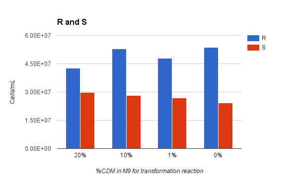
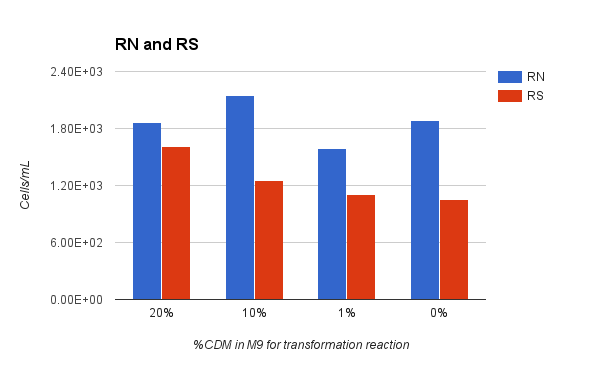
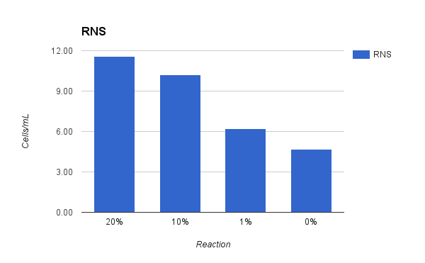

#Cell-Cell attack and Gene Transfer
##Effects of Dilute CDM in M9

###Sep 7 2016

###Cell cultures

**Attacker: CP2204** Rif-r Nov-s Sp-s. Stock 4/15/16. OD 0.2 BoxMorrison2016#1-20.

**Victim: Cp2215** Nov-r Sp-r. Stock 4/15/16 OD 0.2 BoxMorrison2016#21-40

Thaw Stock cells @ 0C. Dilute for growth in CDM + 1%CAT 12mL/tube.

Media batch CAT:9/6/16 (yuri), CDM+CHO+G:?/?/? (Baker)

To CAT from stock shelf add phosphate and glucose. For 300 mL CAT add 10 mL 0.5 M K2HPO4 (sterile filtered) and 3 mL 20% glucose (sterile filtered).

Grow to OD = 0.2 and chill to 0C for use.

| cells | Cp2204 | Cp2204 | Cp2204 | CP2215 | CP2215 | CP2215 |
|-------|--------|--------|--------|--------|--------|--------|
| vol   | 200 uL | 150 ul | 100 uL | 200 uL | 150 uL | 100 uL |
| tube  | A      | B      | C      | D      | E      | F      |
| 10:10 | 37C    | 37C    | 37C    | 37C    | 37C    | 37C    |

[comment]: <> ()

###Attack Reaction

**Cell Prep:**

At OD 0.2 chill to 0C.

Take 2 x 12 mL tubes of cell suspension and spin down at 8k rcf for 8 min in chilled incubator.

Pour off supernatant and resuspend in 732 uL chilled M9 resulting in OD 3.278

Combine cells suspensions to make 1.5 mL suspension, each strain at OD 1.63, hold at 0C.

**Reaction Scheme:**

Each reaction has cells of each strain at OD = 1.0 and the same inducer concentration.

Prepare reaction tubes according to following scheme. First add CDM, then M9 then inducer to each tube and finally cells. Mix/vortex tubes and gently centrifuge to bottom.

| Rx | %CDM | CDM | M9  | Inducer | Cells |
|----|------|-----|-----|---------|-------|
| 1  | 20   | 120 | 0   | 114     | 366   |
| 2  | 10   | 60  | 60  | 114     | 366   |
| 3  | 1    | 6   | 114 | 114     | 366*  |
| 4  | 0    | 0   | 120 | 114     | 366   |

**reaction 3 was prepared by manually adding 6 ul of CDM*

**Inducer Prep:**

| component | Stock     | Inducer    | Dilute by | working stock | Vol/RX | Total (4.2x(Vol/RX)) |
|-----------|-----------|------------|-----------|---------------|--------|----------------------|
| CSP       | 250 ug/mL | 0.2 ug/mL* | 50        | 5 ug/mL       | 24 uL  | 100.8 uL             |
| BSA       | 4%        | 0.04%      | 10        | 0.4%          | 60 uL  | 252 uL               |
| CaCl2     | 1 M       | 5 mM       | 10        | 100 mM        | 30 uL  | 126 uL               |

**typically 0.1 ug/mL of CSP is used, it was doubled in this case to encourage transformation*

**Preparing Working Stocks:**

| Working Stocks | Stock  | M9   | dH2O |
|----------------|--------|------|------|
| CSP            | 100 uL | 5 mL | -    |
| BSA            | 500 uL | 5 mL | -    |
| CaCl2          | 500 uL | -    | 5 mL |

Put reaction tubes in heat block at 37C for **35 minutes**. *reaction started at:*

After 30 min reaction the 600 uL reaction mixture was diluted into 6 mL CAT and incubated at 37C for 60 minutes. *Incubation started at:*

**Expected Results**

|                          | Attacker | Victim    | single cross | single cross | double cross |
|--------------------------|----------|-----------|--------------|--------------|--------------|
| drug                     | Rif-r, Nov-s, Sp-s| N-r, Sp-r | R-r, N-r     | R-r, Sp-r    | RNS          |
| expected number of cells | 10^9     | 10^9      | 10^5         | 10^5         | 30           |
| Dilution for plating     | 10^-5    | 10^-5     | 10^-2        | 10^-2        | 10^-1        |
| number of plates         | 1        | 1         | 2            | 2            | 3            |

**Dilution Scheme**

600 uL of reaction is diluted into 6 mL = 10^-1, 3 Plates: 3RNS

700 uL transferred into 7 mL = 10^-2, 4 plates: 2RN, 2RS

70 uL transferred into 7 mL = 10^-4, don't plate

600 uL transferred into 6 mL = 10^-5, 2 plates: 1R, 1S

Plates are filled with:

1. 3 mL CAT agar
2. 1.5 mL cells + 1.5 mL agar
3. 3 mL CAT agar
4. 3 mL Drug agar

**Drug Assay Prep**

| Drug | overlay  | Stock     |
|------|----------|-----------|
| R    | 40 ug/mL | 20 mg/mL  |
| N    | 10 ug/mL | 10 mg/mL  |
| S    | 160      | 100 mg/mL |

| Agar | Total Plates | Volume Agar | R     | N     | S       |
|------|--------------|-------------|-------|-------|---------|
| R    | 4            | 14 mL       | 28 uL | -     | -       |
| S    | 4            | 14 mL       | -     | -     | 22.4 uL |
| RN   | 8            |  28 mL      | 56 uL | 28 uL | -       |
| RS   | 8            | 28 mL       | 56 uL | -     | 44.8 uL |
| RNS  | 12           | 42 mL       | 84 uL | 42 uL | 67.2 uL |

###Results

**Cell Counts**

| RX | Dilution | Colonies | squares | magnification | colonies/plate | Drug | Cells/ml |
|----|----------|----------|---------|---------------|----------------|------|----------|
| 1  | 1.00E-04 | 638      | 4       | 40            | 6380           | R    | 4.25E+07 |
| 1  | 1.00E-04 | 445      | 4       | 40            | 4450           | S    | 2.97E+07 |
| 1  | 1.00E-01 | 73       | 1       | 4             | 292            | RN   | 1.95E+03 |
| 1  | 1.00E-01 | 67       | 1       | 4             | 268            | RN   | 1.79E+03 |
| 1  | 1.00E-01 | 66       | 1       | 4             | 264            | RS   | 1.76E+03 |
| 1  | 1.00E-01 | 55       | 1       | 4             | 220            | RS   | 1.47E+03 |
| 1  | 1.00E+00 | 19       | 1       | 1             | 19             | RNS  | 1.27E+01 |
| 1  | 1.00E+00 | 21       | 1       | 1             | 21             | RNS  | 1.40E+01 |
| 1  | 1.00E+00 | 12       | 1       | 1             | 12             | RNS  | 8.00E+00 |
|    |          |          |         |               |                |      |          |
| 2  | 1.00E-04 | 795      | 4       | 40            | 7950           | R    | 5.30E+07 |
| 2  | 1.00E-04 | 422      | 4       | 40            | 4220           | S    | 2.81E+07 |
| 2  | 1.00E-01 | 77       | 1       | 4             | 308            | RN   | 2.05E+03 |
| 2  | 1.00E-01 | 84       | 1       | 4             | 336            | RN   | 2.24E+03 |
| 2  | 1.00E-01 | 43       | 1       | 4             | 172            | RS   | 1.15E+03 |
| 2  | 1.00E-01 | 51       | 1       | 4             | 204            | RS   | 1.36E+03 |
| 2  | 1.00E+00 | 13       | 1       | 1             | 13             | RNS  | 8.67E+00 |
| 2  | 1.00E+00 | 15       | 1       | 1             | 15             | RNS  | 1.00E+01 |
| 2  | 1.00E+00 | 18       | 1       | 1             | 18             | RNS  | 1.20E+01 |
|    |          |          |         |               |                |      |          |
| 3  | 1.00E-04 | 719      | 4       | 40            | 7190           | R    | 4.79E+07 |
| 3  | 1.00E-04 | 401      | 4       | 40            | 4010           | S    | 2.67E+07 |
| 3  | 1.00E-01 | 60       | 1       | 4             | 240            | RN   | 1.60E+03 |
| 3  | 1.00E-01 | 59       | 1       | 4             | 236            | RN   | 1.57E+03 |
| 3  | 1.00E-01 | 40       | 1       | 4             | 160            | RS   | 1.07E+03 |
| 3  | 1.00E-01 | 43       | 1       | 4             | 172            | RS   | 1.15E+03 |
| 3  | 1.00E+00 | 8        | 1       | 1             | 8              | RNS  | 5.33E+00 |
| 3  | 1.00E+00 | 8        | 1       | 1             | 8              | RNS  | 5.33E+00 |
| 3  | 1.00E+00 | 12       | 1       | 1             | 12             | RNS  | 8.00E+00 |
|    |          |          |         |               |                |      |          |
| 4  | 1.00E-04 | 806      | 4       | 40            | 8060           | R    | 5.37E+07 |
| 4  | 1.00E-04 | 365      | 4       | 40            | 3650           | S    | 2.43E+07 |
| 4  | 1.00E-01 | 68       | 1       | 4             | 272            | RN   | 1.81E+03 |
| 4  | 1.00E-01 | 73       | 1       | 4             | 292            | RN   | 1.95E+03 |
| 4  | 1.00E-01 | 41       | 1       | 4             | 164            | RS   | 1.09E+03 |
| 4  | 1.00E-01 | 38       | 1       | 4             | 152            | RS   | 1.01E+03 |
| 4  | 1.00E+00 | 3        | 1       | 1             | 3              | RNS  | 2.00E+00 |
| 4  | 1.00E+00 | 11       | 1       | 1             | 11             | RNS  | 7.33E+00 |
| 4  | 1.00E+00 | 7        | 1       | 1             | 7              | RNS  | 4.67E+00 |

**Averaged Results**

| R   | S        | RN       | RS       | RNS      |
|-----|----------|----------|----------|----------|
| 20% | 4.25E+07 | 2.97E+07 | 1.87E+03 | 1.61E+03 |
| 10% | 5.30E+07 | 2.81E+07 | 2.15E+03 | 1.25E+03 |
| 1%  | 4.79E+07 | 2.67E+07 | 1.59E+03 | 1.11E+03 |
| 0%  | 5.37E+07 | 2.43E+07 | 1.88E+03 | 1.05E+03 |

