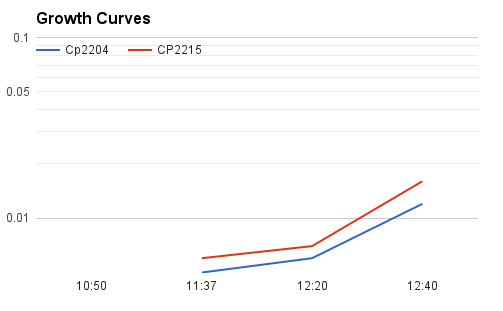

# Device flow through Cell count

# How many cells make it through the droplet generating device and emulsion breaking

### November 15 2016

One volume of cells is made into and emulsion with the device and compared to a control volume.

**Cell cultures:**

| Strain | Competence      | Rifampin  | Spectinomycin | Novobiocin | Label |
|--------|-----------------|-----------|---------------|------------|-------|
| CP2204 | inducible w CSP | Resistant | Sensitive     | Sensitive  | RFP   |
| CP2215 | non-competent   | Sensitive | Resistant     | Resistant  | GFP   |

Thaw Stock cells @ 0C. Dilute for growth in CDM + 1% CAT 12mL/tube.

Grow to OD of 0.015 and chill.

| Cp2204 | CP2215 |
|--------|--------|
| 200 uL | 20 uL  |
| 37C    | 37C    |
| 0.005  | 0.006  |
| 0.006  | 0.007  |
| 0.012  | 0.016  |
|  0C    |  0C    |

###Attack Reaction

**Cell Prep:**

Take 2 x 12 mL tubes of cell suspension and spin down at 8k rcf for 8 min in chilled incubator.

Pour off supernatant and resuspend in 0.45 mL M9 to make OD 0.4.

Combine 300 uL of each strain to make 600 uL cells each at OD 0.2

Pull 500 uL of cell mix into syringe

Resuspend and add to inducer

Load each strain in syringe

**Reaction Scheme:**
When cells meet in droplet device each will be at OD = 1

Droplet generation was done with an ice pack on the syringes.
The heated stage was used to monitor temperature which was about 28C
The outlet tubing fed into a reaction tube in a heat block on ice.
Droplets were generated for about 2.5 hours, and then the reaction tube was placed in a heat block at 37 C for 30 minutes.

*reaction started at:*

**Inducer Prep:**

Produce 700 uL of double strength inducer in M9:

| cell suspension volume to match | 700   |       |         |           |               |            |
|---------------------------------|-------|-------|---------|-----------|---------------|------------|
| Component                       | Stock | unit  | Inducer | Dilute by | Working Stock | 2x inducer |
| CSP                             | 250   | ug/mL | 0.1     | 50        | 5             | 28         |
| BSA                             | 4     | %     | 0.004*  | 10        | 0.4           | 14         |
| CaCl2                           | 1     | M     | 0.005   | 10        | 0.1           | 70         |
| M9                              |       |       |         |           |               | 588        |

**typically 0.04 % of BSA is used, it was reduced to prevent fouling of hydrophobic device*

**Preparing Working Stocks:**

| Working Stocks | Stock  | M9   | dH2O |
|----------------|--------|------|------|
| CSP            | 25 uL  | 1 mL | -    |
| BSA            | 100 uL | 1 mL | -    |
| CaCl2          | 100 uL | -    | 1 mL |

**Emlusion Breaking**

Starting with 200 uL cells in emlusion add 500 uL CAT

Spin down for 30 seconds at 100 x g (in simple centrifuge at heidi's bench)

Pipette oil out from bottom

add two times volume of pico break and gently rock tube

spin again for 1 min at 100-1000 x g

pipette out top(cells) ~ 700 uL

Transfer to another tube and bring up to 2 mL with CAT

Incubate for 1 hour at 37 C in a heat block

**Dilution Scheme**

200 uL cell emulsion was transfered in to 2 mL CAT previously and incubated for 1 hour

150 uL pipetted into 1.5 mL CAT to make 10^-2, 3xRNS, 3xRS, 3xRN, one for further dilution

150 uL pipetted into 1.5 mL CAT to make 10^-3

150 uL pipetted into 1.5 mL CAT to make 10^-4

150 uL pipettd into 1.5 mL CAT to make 10^-5, 3xR, 3xS

**Plates are filled with:**

1. 3 mL CAT agar
2. 1.5 mL cells + 1.5 mL agar
3. 3 mL CAT agar
4. 3 mL Drug agar

**Drug Assay Prep**

| Drug | overlay  | Stock     |
|------|----------|-----------|
| R    | 40 ug/mL | 20 mg/mL  |
| N    | 10 ug/mL | 10 mg/mL  |
| S    | 160      | 100 mg/mL |

| Drug | overlay ug/mL | Stock mg/mL | Volume agar mL | pipette mL |
|------|---------------|-------------|----------------|------------|
| R    | 0.04          | 20          | 15             | 0.03       |
| N    | 0.01          | 10          | 15             | 0.015      |
| S    | 0.16          | 100         | 15             | 0.024      |
###Results

**Cell Counts Cells/mL**

| Plate | Dilution | Colonies/Squares | Magnification | Colonies/Plate | Comment | Cells/mL |
|-------|----------|------------------|---------------|----------------|---------|----------|
| 1     | 1.00E-02 |                  |               | 0              | RNS     | 0        |
| 1     | 1.00E-02 |                  |               | 0              | RNS     | 0        |
| 1     | 1.00E-02 |                  |               | 0              | RNS     | 0        |
|       |          |                  |               |                |         |          |
| 1     | 1.00E-02 |                  |               | 0              | RN      | 0        |
| 1     | 1.00E-02 |                  |               | 0              | RN      | 0        |
| 1     | 1.00E-02 |                  |               | 0              | RN      | 0        |
|       |          |                  |               |                |         |          |
| 1     | 1.00E-02 |                  |               | 0              | RS      | 0        |
| 1     | 1.00E-02 |                  |               | 0              | RS      | 0        |
| 1     | 1.00E-02 |                  |               | 0              | RS      | 0        |
|       |          |                  |               |                |         |          |
| 1     | 1.00E-05 |                  |               | 63             | R       | 4.20E+06 |
| 1     | 1.00E-05 |                  |               | 53             | R       | 3.53E+06 |
| 1     | 1.00E-05 |                  |               | 60             | R       | 4.00E+06 |
|       |          |                  |               |                |         |          |
| 1     | 1.00E-05 |                  |               | 9              | S       | 6.00E+05 |
| 1     | 1.00E-05 |                  |               | 8              | S       | 5.33E+05 |
| 1     | 1.00E-05 |                  |               | 11             | S       | 7.33E+05 |

**Summary of Results by cell count (cells/mL)**

| RNS | RN | RS | R           | S           |
|-----|----|----|-------------|-------------|
| 0   | 0  | 0  | 3911111.111 | 622222.2222 |

## Discussion and Conclusion

Cell pellet didn't make it?
Holding at 4C in M9 kills cells?
M9 old?

Should I check droplet formation in newly coated devices with CDM or CAT?

## Appendix:

To CAT from stock shelf add phosphate and glucose. For 300 mL CAT add 10 mL 0.5 M K2HPO4 (sterile filtered) and 3 mL 20% glucose (sterile filtered).
